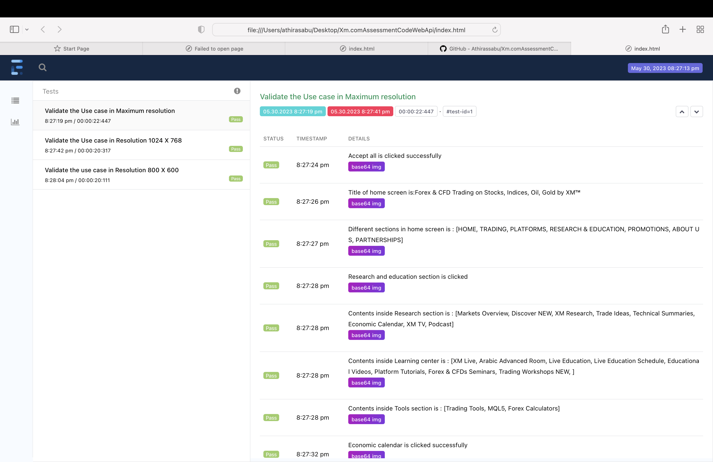
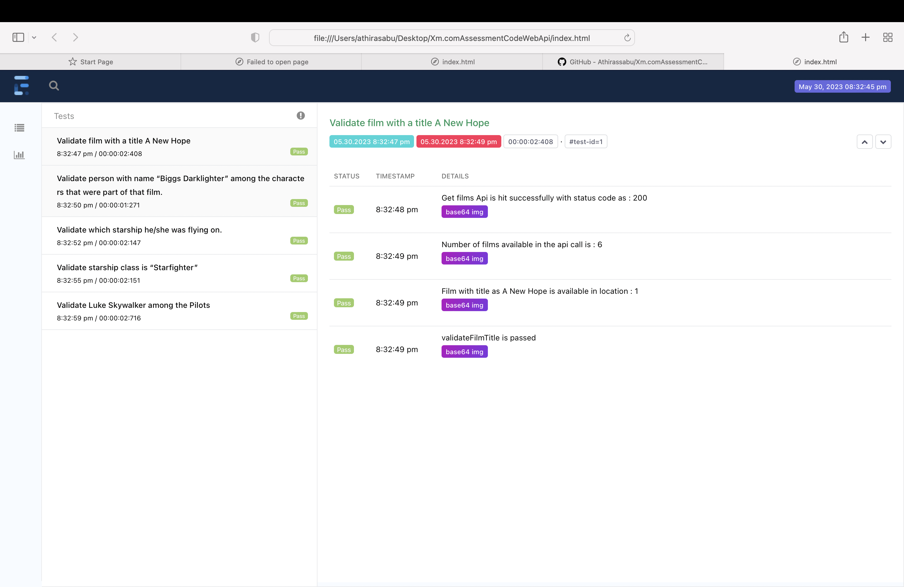

## Abstract Idea about the task:
Automation testing task #1 (UI)
Resource: xm.com
Tools: Java AND (Selenide OR Selenium OR &lt;your_choice&gt;)
Task: Automate next use case to run in three different browser’s screen resolution:
1) Maximum (supported by your display)
2) 1024 x 768
3) 800 x 600
Use Case:
1. Open Home page (make any check here if needed).
2. Click the &lt;Research and Education&gt; link located at the top menu (make any check
here if needed).
3. Click &lt;Economic Calendar&gt; link in the opened menu (make any check here if
needed).
4. Select &lt;Today&gt; on Slider and check that the date is correct.
5. Select &lt;Tomorrow&gt; on Slider and check that the date is correct.
6. Select &lt;Next Week&gt; on Slider and check that the date is correct.
7. Select &lt;Next Month&gt; on Slider and check that the date is correct.
8. Click &lt;here&gt; link in the “disclaimer” block at the bottom (make any check here if
needed).
9. Click &lt;here&gt; link in the “Risk Warning” block at the bottom.
10. Check that &lt;Risk Disclosure&gt; document was opened in new tab.

At the end: Imported IntelliJ/other IDE project so we can run it on our local PC.

Automation testing task #2 (API)
Resource: https://swapi.dev/
Endpoints examples:
 find in site tutorial
Tools: Java AND (Rest Assured OR &lt;your_choice&gt;)
Use Case:
1. Find film with a title ”A New Hope”
2. Using previous response (1) find person with name “Biggs Darklighter” among
the characters that were part of that film.
3. Using previous response (2) find which starship he/she was flying on.
4. Using previous response (3) check next:
a. starship class is “Starfighter”
b. “Luke Skywalker” is among pilots that were also flying this kind of starship

At the end: Imported IntelliJ/other project so we can run it on our local PC.

# selenium-TestNG-Rest assured java-maven

Automation Testing Using Java, Selenium with TestNg.
TestNG is a powerful testing framework, an enhanced version of JUnit which was in use for a long time before TestNG came into existence. NG stands for 'Next Generation'.

# TestNG framework provides the following features

1.	Annotations help us organize the tests easily.
2.	Flexible test configuration.
3.	Test cases can be grouped more easily.
4.	Parallelization of tests can be achieved using TestNG.
5.	Support for data-driven testing.
6.	Inbuilt reporting.
7.	Supports Web and Api

## Framework Architecture

 1.     src/main/java/com.stcTv- It contains all framework packages
 2.	src/test/java/ - It contains test cases and base class.
 3.	src/test/resources – It contains config file.
 4.	pom file which has all needed dependency
 5.	testng.xml to run the test script
 6.	My framework will support parallel execution,I have implemented it with the help of thread local
 7.	It will also support other browsers.
 8.	I have created separate tests and page classes for each region to show page object model approach.
 9.	I have saved validation data under src/test/resources in config.properties file.Since we have only three test cases I have added in values in config file else excel read approach can be used.
 
 ## Reporting using extent report
 I have used extent report to have a customized report.Kindly find the screenshot of generated report.
 
 # Web Report
 
 
  # Api Report
 
 
## Execution from IDE
# Execution is possible from both testng.xml and maven commands so jenkins integration will be easy

	You can start execution from testing.xml file after cloning the project and see the report in index.html
	To run Web change group name as web,for api change to api to run both web and api provide group name as sanity in testng.xml.
	You can run the project from terminal using mvn clean test
	You can also run giving mvn test -Dgroups=web or mvn test -Dgroups=api or mvn test -Dgroups=sanity

## Set-Up prerequisites.

1.	Java version - jdk 1.9
2.	Maven version - apache maven 3.8.1,
3.	maven-surefire-plugin - 2.14.1
4.	IntelliJ/Eclipse Cucumber plugins

# Note :
This is basically Web,page object model framework using testng and java with extent report.I have added rest api test cases to the existing framework to avoid sending multiple files.Please let me know if you need additional framework for Rest assured.
When you run Api test cases the browser will open and close since this is a web based framework and thread local to execute parallel execution is implemented and extent report also uses thread local hence to show the execution report I have used the same methods.
Please let me know if you need additional framework for rest assured alone,I can prepare and send.

Thanks,
Athira

