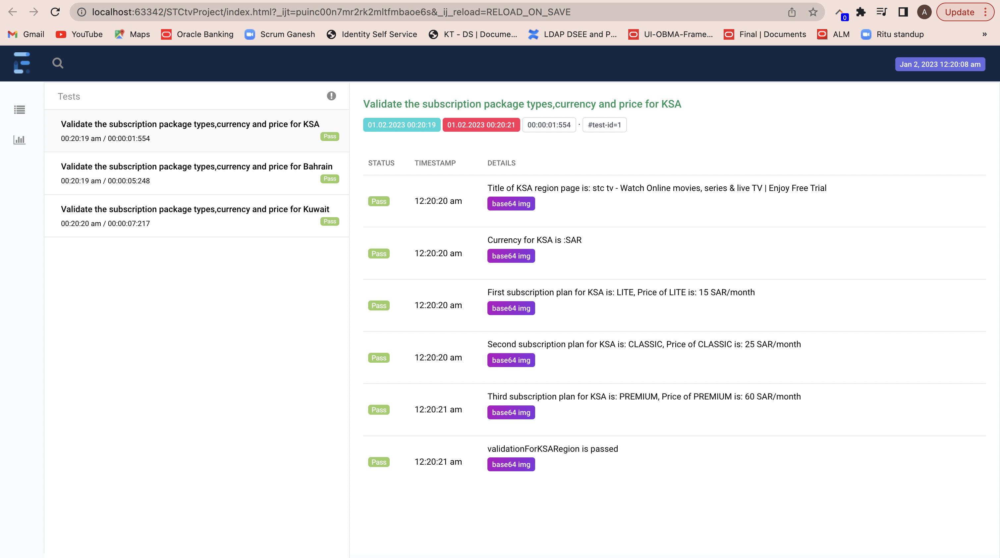

## Abstract Idea about the task:
Steps
1. Navigate to the following URL https://subscribe.stctv.com/
2. Validate the Subscription Packages – Type & Price and Currency for all Countries (SA /
Kuwait and Baharin)

## Test cases created:

1. Validation for KSA region-This test case will validate type of subscription,price and currency for KSA region
2. Validation for Bahrain region-This test case will validate type of subscription,price and currency for Bahrain region
3. Validation for Kuwait region-This test case will validate type of subscription,price and currency for Kuwait region

# selenium-TestNG-java-maven

Automation Testing Using Java, Selenium with TestNg.
TestNG is a powerful testing framework, an enhanced version of JUnit which was in use for a long time before TestNG came into existence. NG stands for 'Next Generation'.
# TestNG framework provides the following features

1.	Annotations help us organize the tests easily.
2.	Flexible test configuration.
3.	Test cases can be grouped more easily.
4.	Parallelization of tests can be achieved using TestNG.
5.	Support for data-driven testing.
6.	Inbuilt reporting.

## Framework Architecture

 1.     src/main/java/com.stcTv- It contains all framework packages
 2.	src/test/java/ - It contains test cases and base class.
 3.	src/test/resources – It contains config file.
 4.	pom file which has all needed dependency
 5.	testng.xml to run the test script
 6.	My framework will support parallel execution,I have implemented it with the help of thread local
 7.	It will also support other browsers.
 8.	I have created separate tests and page classes for each region to show page object model approach.
 9.	I have saved validation data under src/test/resources in config.properties file.Since we have only three test cases I have added in values in config file else excel read approach can be used.
 
 ## Reporting using extent report
 I have used extent report to have a customized report.Kindly find the screenshot of generated report.
 
 
## Execution from IDE

	You can start execution from testing.xml file after cloning the project.

## Set-Up prerequisites.

1.	Java version - jdk 1.8.0_281,
2.	Maven version - apache maven 3.8.1,
3.	maven-surefire-plugin - 3.0.0-M1
4.	IntelliJ/Eclipse Cucumber plugins

## Maven Dependencies.

1.	Testng - 7.4.0
2.	owner - 1.0.12
3.	junit - 4.13.2
4.	webdrivermanager - 5.0.3
5.	selenium-java - 4.0.0

